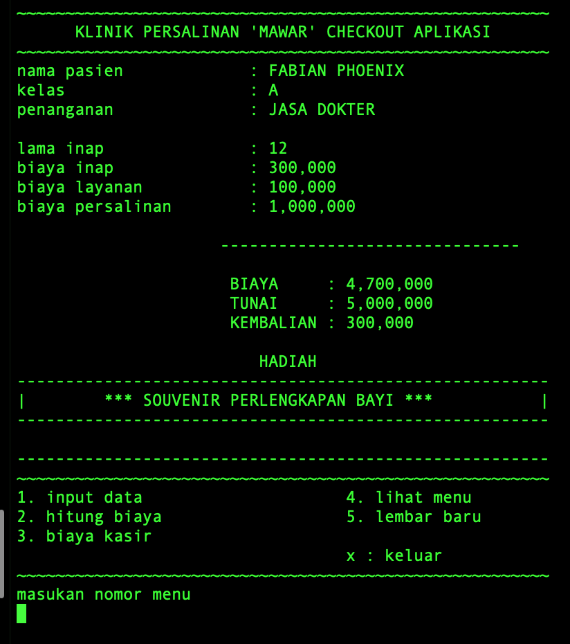

# aplikasi-pembayaran-kasir

aplikasi pembayaran klinik persalinan mawar.



## prerequisite

- C standart library and headers

### download

```lisp
git clone git@github.com:savazeb/aplikasi-pembayaran-kasir.git
```

### compile

```lisp
g++ /{your os}/main.cpp -o app.exe
```

### run

```lisp
./app.exe
```
